# [📈 Live Status](https://status.acdh-dev.oeaw.ac.at/): <!--live status--> **🟩 All systems operational**

This repository contains the open-source uptime monitor and status page for [Upptime](https://upptime.js.org), powered by [Upptime](https://github.com/upptime/upptime).

With [Upptime](https://upptime.js.org), you can get your own unlimited and free uptime monitor and status page, powered entirely by a GitHub repository. We use [Issues](https://github.com/upptime/upptime/issues) as incident reports, [Actions](https://github.com/acdh-oeaw/status/actions) as uptime monitors, and [Pages](https://status.acdh-dev.oeaw.ac.at/) for the status page.

<!--start: status pages-->
<!-- This summary is generated by Upptime (https://github.com/upptime/upptime) -->
<!-- Do not edit this manually, your changes will be overwritten -->
<!-- prettier-ignore -->
| URL | Status | History | Response Time | Uptime |
| --- | ------ | ------- | ------------- | ------ |
|  [ACDH shared assets](https://shared.acdh.oeaw.ac.at/test.html) | 🟩 Up | [acdh-shared-assets.yml](https://github.com/acdh-oeaw/status/commits/HEAD/history/acdh-shared-assets.yml) | 

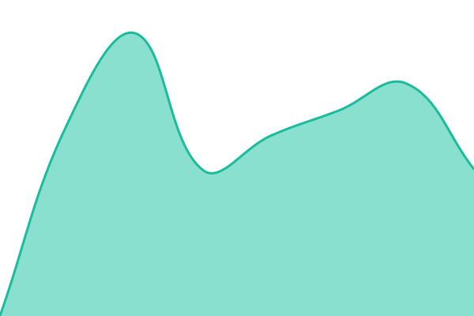 1387ms
     
 | 

<a href="https://acdh-oeaw.github.io/status/history/acdh-shared-assets">100.00%</a>
    

|  [ARCHE](https://arche.acdh.oeaw.ac.at/browser/) | 🟩 Up | [arche.yml](https://github.com/acdh-oeaw/status/commits/HEAD/history/arche.yml) | 

 1569ms
     
 | 

<a href="https://acdh-oeaw.github.io/status/history/arche">100.00%</a>
    

|  [Baserow](https://baserow.acdh-dev.oeaw.ac.at/) | 🟩 Up | [baserow.yml](https://github.com/acdh-oeaw/status/commits/HEAD/history/baserow.yml) | 

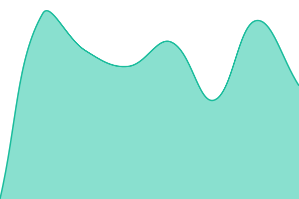 2034ms
     
 | 

<a href="https://acdh-oeaw.github.io/status/history/baserow">100.00%</a>
    

|  [DHCR](https://dhcr.clarin-dariah.eu) | 🟩 Up | [dhcr.yml](https://github.com/acdh-oeaw/status/commits/HEAD/history/dhcr.yml) | 

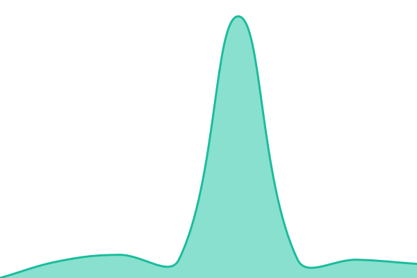 2347ms
     
 | 

<a href="https://acdh-oeaw.github.io/status/history/dhcr">100.00%</a>
    

|  [IIIF server](https://iiif.acdh.oeaw.ac.at/iiif/images/wpn/0293.jp2/full/max/0/default.jpg) | 🟩 Up | [iiif-server.yml](https://github.com/acdh-oeaw/status/commits/HEAD/history/iiif-server.yml) | 

 2226ms
     
 | 

<a href="https://acdh-oeaw.github.io/status/history/iiif-server">100.00%</a>
    

|  [Mattermost](https://mattermost.acdh.oeaw.ac.at/login) | 🟩 Up | [mattermost.yml](https://github.com/acdh-oeaw/status/commits/HEAD/history/mattermost.yml) | 

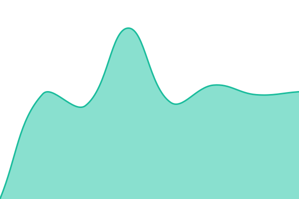 1163ms
     
 | 

<a href="https://acdh-oeaw.github.io/status/history/mattermost">99.67%</a>
    

|  [PMB](https://pmb.acdh.oeaw.ac.at/) | 🟩 Up | [pmb.yml](https://github.com/acdh-oeaw/status/commits/HEAD/history/pmb.yml) | 

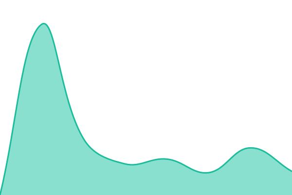 18424ms
     
 | 

<a href="https://acdh-oeaw.github.io/status/history/pmb">95.50%</a>
    

|  [Rancher](https://rancher.acdh-dev.oeaw.ac.at/) | 🟩 Up | [rancher.yml](https://github.com/acdh-oeaw/status/commits/HEAD/history/rancher.yml) | 

 808ms
     
 | 

<a href="https://acdh-oeaw.github.io/status/history/rancher">100.00%</a>
    

|  [Recogito](https://recogito.acdh.oeaw.ac.at/de/sign-in) | 🟩 Up | [recogito.yml](https://github.com/acdh-oeaw/status/commits/HEAD/history/recogito.yml) | 

 1096ms
     
 | 

<a href="https://acdh-oeaw.github.io/status/history/recogito">99.59%</a>
    

|  [Redmine](https://redmine.acdh.oeaw.ac.at/) | 🟩 Up | [redmine.yml](https://github.com/acdh-oeaw/status/commits/HEAD/history/redmine.yml) | 

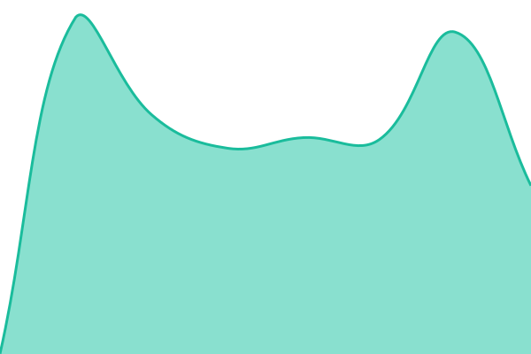 979ms
     
 | 

<a href="https://acdh-oeaw.github.io/status/history/redmine">100.00%</a>
    

|  [SSHOC Marketplace API](https://marketplace-api.sshopencloud.eu/api/property-types) | 🟩 Up | [sshoc-marketplace-api.yml](https://github.com/acdh-oeaw/status/commits/HEAD/history/sshoc-marketplace-api.yml) | 

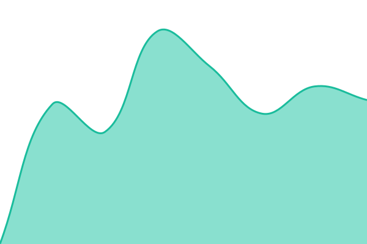 788ms
     
 | 

<a href="https://acdh-oeaw.github.io/status/history/sshoc-marketplace-api">98.88%</a>
    

|  [Teach DARIAH](https://teach.dariah.eu) | 🟩 Up | [teach-dariah.yml](https://github.com/acdh-oeaw/status/commits/HEAD/history/teach-dariah.yml) | 

 2468ms
     
 | 

<a href="https://acdh-oeaw.github.io/status/history/teach-dariah">100.00%</a>
    

|  [Triplestore](https://triplestore.acdh-dev.oeaw.ac.at/bgherkules/) | 🟩 Up | [triplestore.yml](https://github.com/acdh-oeaw/status/commits/HEAD/history/triplestore.yml) | 

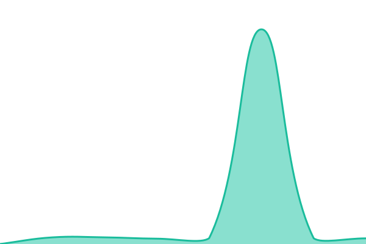 959ms
     
 | 

<a href="https://acdh-oeaw.github.io/status/history/triplestore">100.00%</a>
    

|  [Typesense](https://typesense.acdh-dev.oeaw.ac.at/health) | 🟩 Up | [typesense.yml](https://github.com/acdh-oeaw/status/commits/HEAD/history/typesense.yml) | 

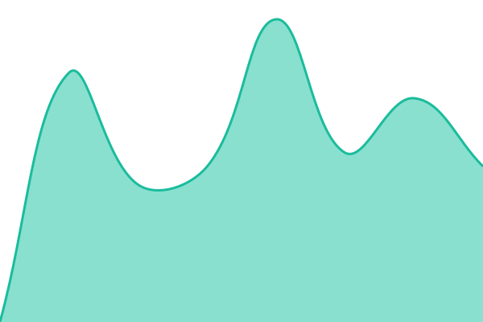 892ms
     
 | 

<a href="https://acdh-oeaw.github.io/status/history/typesense">100.00%</a>
    

|  [Vocabs](https://vocabs.acdh.oeaw.ac.at/en/) | 🟩 Up | [vocabs.yml](https://github.com/acdh-oeaw/status/commits/HEAD/history/vocabs.yml) | 

 967ms
     
 | 

<a href="https://acdh-oeaw.github.io/status/history/vocabs">100.00%</a>
    

|  [Imprint](https://imprint.acdh.oeaw.ac.at) | 🟩 Up | [imprint.yml](https://github.com/acdh-oeaw/status/commits/HEAD/history/imprint.yml) | 

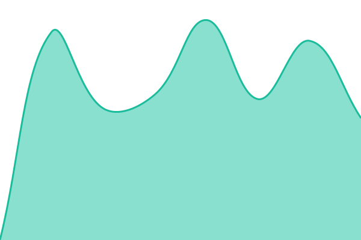 820ms
     
 | 

<a href="https://acdh-oeaw.github.io/status/history/imprint">100.00%</a>
    

|  [Viewer](https://viewer.acdh.oeaw.ac.at) | 🟩 Up | [viewer.yml](https://github.com/acdh-oeaw/status/commits/HEAD/history/viewer.yml) | 

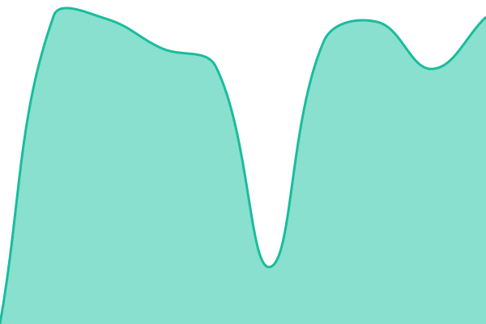 1871ms
     
 | 

<a href="https://acdh-oeaw.github.io/status/history/viewer">99.78%</a>
    

|  [Austria Media Corpus (AMC)](https://noske-amc.acdh.oeaw.ac.at/) | 🟩 Up | [austria-media-corpus-amc.yml](https://github.com/acdh-oeaw/status/commits/HEAD/history/austria-media-corpus-amc.yml) | 

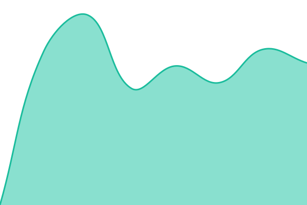 1484ms
     
 | 

<a href="https://acdh-oeaw.github.io/status/history/austria-media-corpus-amc">100.00%</a>
    

<!--end: status pages-->

[**Visit our status website →**](https://status.acdh-dev.oeaw.ac.at/)

## 📄 License

- Powered by: [Upptime](https://github.com/upptime/upptime)
- Code: [MIT](./LICENSE) © [Upptime](https://upptime.js.org)
- Data in the `./history` directory: [Open Database License](https://opendatacommons.org/licenses/odbl/1-0/)
