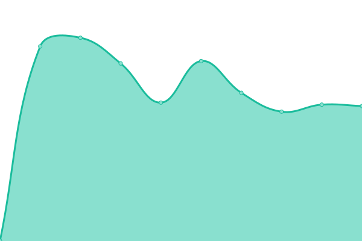

# [📈 Live Status](https://status.acdh-dev.oeaw.ac.at/): <!--live status--> **🟩 All systems operational**

This repository contains the open-source uptime monitor and status page for [Upptime](https://upptime.js.org), powered by [Upptime](https://github.com/upptime/upptime).

With [Upptime](https://upptime.js.org), you can get your own unlimited and free uptime monitor and status page, powered entirely by a GitHub repository. We use [Issues](https://github.com/upptime/upptime/issues) as incident reports, [Actions](https://github.com/acdh-oeaw/status/actions) as uptime monitors, and [Pages](https://status.acdh-dev.oeaw.ac.at/) for the status page.

<!--start: status pages-->
<!-- This summary is generated by Upptime (https://github.com/upptime/upptime) -->
<!-- Do not edit this manually, your changes will be overwritten -->
<!-- prettier-ignore -->
| URL | Status | History | Response Time | Uptime |
| --- | ------ | ------- | ------------- | ------ |
|  [ACDH-CH shared assets](https://shared.acdh.oeaw.ac.at/test.html) | 🟩 Up | [acdh-ch-shared-assets.yml](https://github.com/acdh-oeaw/status/commits/HEAD/history/acdh-ch-shared-assets.yml) | 

 1043ms
     
 | 

<a href="https://acdh-oeaw.github.io/status/history/acdh-ch-shared-assets">97.86%</a>
    

|  [ARCHE](https://arche.acdh.oeaw.ac.at/browser/) | 🟩 Up | [arche.yml](https://github.com/acdh-oeaw/status/commits/HEAD/history/arche.yml) | 

 1297ms
     
 | 

<a href="https://acdh-oeaw.github.io/status/history/arche">98.03%</a>
    

|  [Baserow](https://baserow.acdh-dev.oeaw.ac.at/) | 🟩 Up | [baserow.yml](https://github.com/acdh-oeaw/status/commits/HEAD/history/baserow.yml) | 

 3437ms
     
 | 

<a href="https://acdh-oeaw.github.io/status/history/baserow">98.04%</a>
    

|  [DHCR](https://dhcr.clarin-dariah.eu) | 🟩 Up | [dhcr.yml](https://github.com/acdh-oeaw/status/commits/HEAD/history/dhcr.yml) | 

 7760ms
     
 | 

<a href="https://acdh-oeaw.github.io/status/history/dhcr">97.81%</a>
    

|  [Mattermost](https://mattermost.acdh.oeaw.ac.at/login) | 🟩 Up | [mattermost.yml](https://github.com/acdh-oeaw/status/commits/HEAD/history/mattermost.yml) | 

 915ms
     
 | 

<a href="https://acdh-oeaw.github.io/status/history/mattermost">98.06%</a>
    

|  [PMB](https://pmb.acdh.oeaw.ac.at/) | 🟩 Up | [pmb.yml](https://github.com/acdh-oeaw/status/commits/HEAD/history/pmb.yml) | 

 1048ms
     
 | 

<a href="https://acdh-oeaw.github.io/status/history/pmb">98.07%</a>
    

|  [Rancher](https://rancher.acdh-dev.oeaw.ac.at/) | 🟩 Up | [rancher.yml](https://github.com/acdh-oeaw/status/commits/HEAD/history/rancher.yml) | 

 741ms
     
 | 

<a href="https://acdh-oeaw.github.io/status/history/rancher">97.92%</a>
    

|  [OEAW Resources](https://www.oeaw.ac.at/resources/) | 🟩 Up | [oeaw-resources.yml](https://github.com/acdh-oeaw/status/commits/HEAD/history/oeaw-resources.yml) | 

 1004ms
     
 | 

<a href="https://acdh-oeaw.github.io/status/history/oeaw-resources">96.97%</a>
    

|  [Redmine](https://redmine.acdh.oeaw.ac.at/) | 🟩 Up | [redmine.yml](https://github.com/acdh-oeaw/status/commits/HEAD/history/redmine.yml) | 

 801ms
     
 | 

<a href="https://acdh-oeaw.github.io/status/history/redmine">98.12%</a>
    

|  [SSHOC Marketplace API](https://marketplace-api.sshopencloud.eu/api/property-types) | 🟩 Up | [sshoc-marketplace-api.yml](https://github.com/acdh-oeaw/status/commits/HEAD/history/sshoc-marketplace-api.yml) | 

 792ms
     
 | 

<a href="https://acdh-oeaw.github.io/status/history/sshoc-marketplace-api">97.78%</a>
    

|  [Teach DARIAH](https://teach.dariah.eu/course/index.php) | 🟩 Up | [teach-dariah.yml](https://github.com/acdh-oeaw/status/commits/HEAD/history/teach-dariah.yml) | 

 1803ms
     
 | 

<a href="https://acdh-oeaw.github.io/status/history/teach-dariah">96.81%</a>
    

|  [Triplestore](https://triplestore.acdh-dev.oeaw.ac.at/bgherkules/) | 🟩 Up | [triplestore.yml](https://github.com/acdh-oeaw/status/commits/HEAD/history/triplestore.yml) | 

 649ms
     
 | 

<a href="https://acdh-oeaw.github.io/status/history/triplestore">98.19%</a>
    

|  [Typesense](https://typesense.acdh-dev.oeaw.ac.at/health) | 🟩 Up | [typesense.yml](https://github.com/acdh-oeaw/status/commits/HEAD/history/typesense.yml) | 

 633ms
     
 | 

<a href="https://acdh-oeaw.github.io/status/history/typesense">98.13%</a>
    

|  [Vocabs](https://vocabs.acdh.oeaw.ac.at/en/) | 🟩 Up | [vocabs.yml](https://github.com/acdh-oeaw/status/commits/HEAD/history/vocabs.yml) | 

 1246ms
     
 | 

<a href="https://acdh-oeaw.github.io/status/history/vocabs">98.21%</a>
    

|  [Imprint](https://imprint.acdh.oeaw.ac.at) | 🟩 Up | [imprint.yml](https://github.com/acdh-oeaw/status/commits/HEAD/history/imprint.yml) | 

 871ms
     
 | 

<a href="https://acdh-oeaw.github.io/status/history/imprint">98.22%</a>
    

<!--end: status pages-->

[**Visit our status website →**](https://status.acdh-dev.oeaw.ac.at/)

## 📄 License

- Powered by: [Upptime](https://github.com/upptime/upptime)
- Code: [MIT](./LICENSE) © [Upptime](https://upptime.js.org)
- Data in the `./history` directory: [Open Database License](https://opendatacommons.org/licenses/odbl/1-0/)
