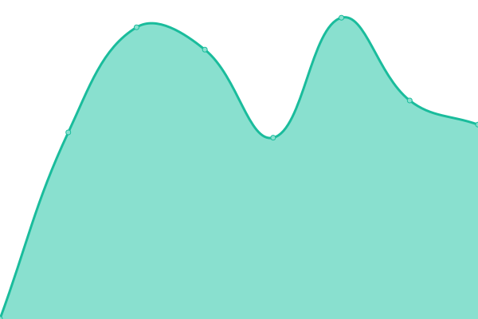
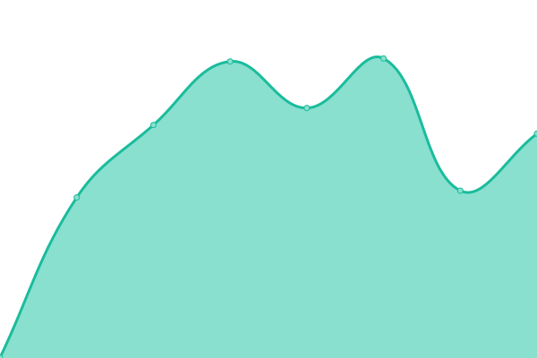

# [📈 Live Status](https://demo.upptime.js.org): <!--live status--> **🟩 All systems operational**

This repository contains the open-source uptime monitor and status page for [Upptime](https://upptime.js.org), powered by [Upptime](https://github.com/upptime/upptime).

With [Upptime](https://upptime.js.org), you can get your own unlimited and free uptime monitor and status page, powered entirely by a GitHub repository. We use [Issues](https://github.com/upptime/upptime/issues) as incident reports, [Actions](https://github.com/acdh-oeaw/status/actions) as uptime monitors, and [Pages](https://demo.upptime.js.org) for the status page.

<!--start: status pages-->
<!-- This summary is generated by Upptime (https://github.com/upptime/upptime) -->
<!-- Do not edit this manually, your changes will be overwritten -->
<!-- prettier-ignore -->
| URL | Status | History | Response Time | Uptime |
| --- | ------ | ------- | ------------- | ------ |
|  [ARCHE](https://arche.acdh.oeaw.ac.at/browser/) | 🟩 Up | [arche.yml](https://github.com/acdh-oeaw/status/commits/HEAD/history/arche.yml) | 

 1236ms
     
 | 

<a href="https://acdh-oeaw.github.io/status/history/arche">89.89%</a>
    

|  [Baserow](https://baserow.acdh-dev.oeaw.ac.at/) | 🟩 Up | [baserow.yml](https://github.com/acdh-oeaw/status/commits/HEAD/history/baserow.yml) | 

 1886ms
     
 | 

<a href="https://acdh-oeaw.github.io/status/history/baserow">81.00%</a>
    

|  [OEAW Resources](https://www.oeaw.ac.at/resources/) | 🟩 Up | [oeaw-resources.yml](https://github.com/acdh-oeaw/status/commits/HEAD/history/oeaw-resources.yml) | 

 1449ms
     
 | 

<a href="https://acdh-oeaw.github.io/status/history/oeaw-resources">86.57%</a>
    

|  [Typesense](https://typesense.acdh-dev.oeaw.ac.at/health) | 🟩 Up | [typesense.yml](https://github.com/acdh-oeaw/status/commits/HEAD/history/typesense.yml) | 

 888ms
     
 | 

<a href="https://acdh-oeaw.github.io/status/history/typesense">91.13%</a>
    

|  [Vocabs](https://vocabs.acdh.oeaw.ac.at/en/) | 🟩 Up | [vocabs.yml](https://github.com/acdh-oeaw/status/commits/HEAD/history/vocabs.yml) | 

 1047ms
     
 | 

<a href="https://acdh-oeaw.github.io/status/history/vocabs">91.31%</a>
    

|  [Teach DARIAH](https://teach.dariah.eu/course/index.php) | 🟩 Up | [teach-dariah.yml](https://github.com/acdh-oeaw/status/commits/HEAD/history/teach-dariah.yml) | 

 2047ms
     
 | 

<a href="https://acdh-oeaw.github.io/status/history/teach-dariah">85.74%</a>
    

|  [SSHOC Marketplace API](https://marketplace-api.sshopencloud.eu/api/property-types) | 🟩 Up | [sshoc-marketplace-api.yml](https://github.com/acdh-oeaw/status/commits/HEAD/history/sshoc-marketplace-api.yml) | 

 846ms
     
 | 

<a href="https://acdh-oeaw.github.io/status/history/sshoc-marketplace-api">91.35%</a>
    

|  [Redmine](https://redmine.acdh.oeaw.ac.at/) | 🟩 Up | [redmine.yml](https://github.com/acdh-oeaw/status/commits/HEAD/history/redmine.yml) | 

 1008ms
     
 | 

<a href="https://acdh-oeaw.github.io/status/history/redmine">85.79%</a>
    

|  [Mattermost](https://mattermost.acdh.oeaw.ac.at/login) | 🟩 Up | [mattermost.yml](https://github.com/acdh-oeaw/status/commits/HEAD/history/mattermost.yml) | 

 677ms
     
 | 

<a href="https://acdh-oeaw.github.io/status/history/mattermost">90.32%</a>
    

|  [DHCR](https://dhcr.clarin-dariah.eu) | 🟩 Up | [dhcr.yml](https://github.com/acdh-oeaw/status/commits/HEAD/history/dhcr.yml) | 

 3818ms
     
 | 

<a href="https://acdh-oeaw.github.io/status/history/dhcr">85.83%</a>
    

<!--end: status pages-->

[**Visit our status website →**](https://demo.upptime.js.org)

## 📄 License

- Powered by: [Upptime](https://github.com/upptime/upptime)
- Code: [MIT](./LICENSE) © [Upptime](https://upptime.js.org)
- Data in the `./history` directory: [Open Database License](https://opendatacommons.org/licenses/odbl/1-0/)
